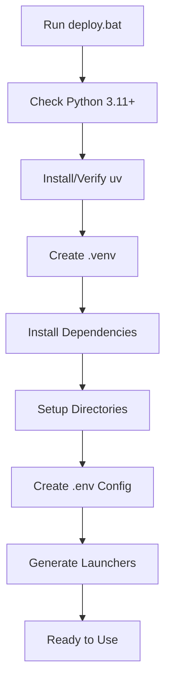
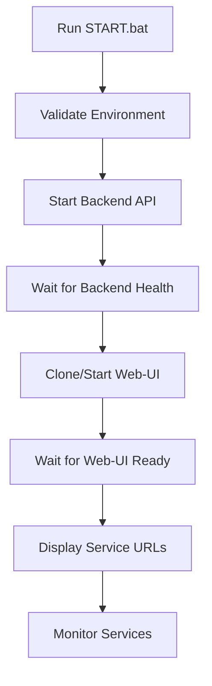

# Workflow-Use Suite - Function Sequences & Validation

This document outlines all function sequences, features, and validation procedures for the Workflow-Use Suite.

## 🎯 Core Function Sequences

### 1. Initial Deployment Sequence



**Steps:**
1. **Environment Validation**
   - Check Python version (≥3.11)
   - Verify/install uv package manager
   - Check Git availability (optional)
   - Check Node.js (for UI development)

2. **Virtual Environment Setup**
   - Create `.venv` directory
   - Install core dependencies via `uv sync`
   - Install Playwright browsers

3. **Project Structure Creation**
   - Create `data/`, `logs/`, `workflows/` directories
   - Generate `.env` configuration file
   - Setup workflow backend structure

4. **Launcher Generation**
   - Create `START.bat` (main suite launcher)
   - Create `start-backend.bat` (backend only)
   - Create `start-webui.bat` (web-ui only)
   - Create utility scripts (cleanup, update, status)

### 2. Suite Startup Sequence



**Steps:**
1. **Pre-flight Checks**
   - Verify `.venv` exists
   - Check `pyproject.toml` present
   - Validate Python launcher

2. **Backend Startup**
   - Navigate to `workflows/` directory
   - Start `backend.api` module
   - Wait for health endpoint response
   - Display API documentation URL

3. **Web-UI Integration**
   - Check for `browser-use-web-ui` directory
   - Clone from GitHub if missing
   - Start Gradio application
   - Wait for web interface availability

4. **Service Monitoring**
   - Display all service URLs
   - Monitor process health
   - Handle graceful shutdown on Ctrl+C

### 3. Component-Specific Sequences

#### Backend Only (`start-backend.bat`)
```
1. Validate environment
2. Start FastAPI backend
3. Display API endpoints
4. Monitor until stopped
```

#### Web-UI Only (`start-webui.bat`)
```
1. Validate environment
2. Clone web-ui if needed
3. Start Gradio interface
4. Display web URL
5. Monitor until stopped
```

## 🧪 Validation Test Sequences

### Test 1: Environment Setup Validation
- ✅ Python 3.11+ availability
- ✅ Virtual environment presence
- ✅ Project configuration files
- ✅ UV package manager
- ✅ Git availability (optional)

### Test 2: Dependency Installation
- ✅ `uv sync` execution
- ✅ Core package imports (FastAPI, Uvicorn, Pydantic, etc.)
- ✅ Optional package availability
- ✅ Browser automation tools

### Test 3: Launcher Scripts Generation
- ✅ `deploy.bat` execution
- ✅ `START.bat` creation
- ✅ Component launchers creation
- ✅ Configuration files generation

### Test 4: Backend Service Startup
- ✅ Backend API initialization
- ✅ Health endpoint response
- ✅ API documentation availability
- ✅ Process management

### Test 5: Web-UI Integration
- ✅ Repository cloning capability
- ✅ Gradio interface startup
- ✅ Web service accessibility
- ✅ Browser automation readiness

### Test 6: Main Launcher Functionality
- ✅ Python script syntax validation
- ✅ Command-line argument handling
- ✅ Usage information display
- ✅ Error handling

### Test 7: Configuration Management
- ✅ `.env` file creation/parsing
- ✅ Environment variable loading
- ✅ Configuration validation
- ✅ Multi-environment support

### Test 8: Full Suite Integration
- ✅ Complete startup sequence
- ✅ Service intercommunication
- ✅ Health monitoring
- ✅ Graceful shutdown

## 🔄 Error Handling Sequences

### Dependency Conflicts
```
1. Detect pyyaml version conflicts
2. Remove problematic docker dependencies
3. Install core dependencies only
4. Validate successful installation
5. Continue with deployment
```

### Service Startup Failures
```
1. Detect service startup failure
2. Log error details
3. Attempt graceful recovery
4. Display troubleshooting information
5. Provide manual intervention steps
```

### Missing Components
```
1. Check for required files/directories
2. Auto-create missing structure
3. Clone missing repositories
4. Install missing dependencies
5. Retry operation
```

## 📊 Validation Metrics

### Success Criteria
- **Environment Setup**: 100% of checks pass
- **Dependency Installation**: All core packages importable
- **Service Startup**: Health endpoints respond within 30s
- **Integration**: All services communicate successfully
- **Error Handling**: Graceful failure and recovery

### Performance Benchmarks
- **Deployment Time**: < 5 minutes (first run)
- **Startup Time**: < 30 seconds (subsequent runs)
- **Memory Usage**: < 500MB (complete suite)
- **Response Time**: < 2 seconds (health checks)

## 🛠️ Troubleshooting Sequences

### Common Issues & Solutions

#### 1. Python Version Issues
```
Problem: Python < 3.11
Solution: Install Python 3.11+ from python.org
Validation: python --version
```

#### 2. UV Installation Failures
```
Problem: UV not found or installation fails
Solution: pip install uv OR use PowerShell installer
Validation: uv --version
```

#### 3. Dependency Conflicts
```
Problem: Package version conflicts
Solution: Use simplified pyproject.toml
Validation: uv sync success
```

#### 4. Service Port Conflicts
```
Problem: Ports 8000/7788 already in use
Solution: Kill existing processes OR change ports
Validation: netstat -an | findstr :8000
```

#### 5. Git Clone Failures
```
Problem: Cannot clone browser-use-web-ui
Solution: Check internet connection OR use manual download
Validation: git clone test
```

## 🎯 Feature Validation Matrix

| Feature | Test Method | Expected Result | Validation Command |
|---------|-------------|-----------------|-------------------|
| Python 3.11+ | Version check | ≥3.11.0 | `python --version` |
| UV Package Manager | Installation test | Success | `uv --version` |
| Virtual Environment | Directory check | `.venv` exists | `dir .venv` |
| Core Dependencies | Import test | No errors | `uv run python -c "import fastapi"` |
| Backend API | HTTP request | 200 OK | `curl http://127.0.0.1:8000/health` |
| Web-UI Interface | HTTP request | 200 OK | `curl http://127.0.0.1:7788` |
| Configuration | File parsing | Valid config | `.env` file exists |
| Launcher Scripts | File existence | All present | `dir *.bat` |

## 🚀 Deployment Validation Checklist

### Pre-Deployment
- [ ] Python 3.11+ installed
- [ ] Internet connection available
- [ ] Sufficient disk space (>1GB)
- [ ] Administrator privileges (Windows)

### During Deployment
- [ ] UV package manager installed
- [ ] Virtual environment created
- [ ] Dependencies installed successfully
- [ ] Project structure created
- [ ] Configuration files generated
- [ ] Launcher scripts created

### Post-Deployment
- [ ] All launcher scripts executable
- [ ] Backend API starts successfully
- [ ] Web-UI interface accessible
- [ ] Health checks pass
- [ ] Error handling works
- [ ] Graceful shutdown functions

### Validation Commands
```batch
# Run comprehensive validation
test-all.bat

# Manual validation steps
uv run python validate.py
START.bat
curl http://127.0.0.1:8000/health
curl http://127.0.0.1:7788
```

## 📈 Continuous Validation

### Automated Testing
- Run `test-all.bat` before each release
- Validate on multiple Windows versions
- Test with different Python versions (3.11, 3.12)
- Verify with fresh virtual environments

### Manual Testing
- Complete deployment from scratch
- Test all launcher combinations
- Verify error handling scenarios
- Validate documentation accuracy

### Performance Monitoring
- Track deployment times
- Monitor memory usage
- Measure startup performance
- Validate response times

This comprehensive validation ensures the Workflow-Use Suite functions correctly across all supported environments and use cases.

